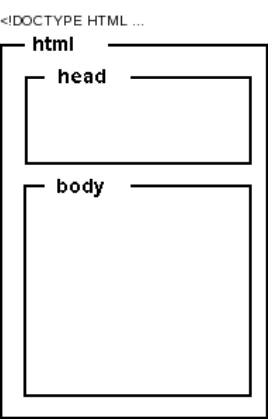
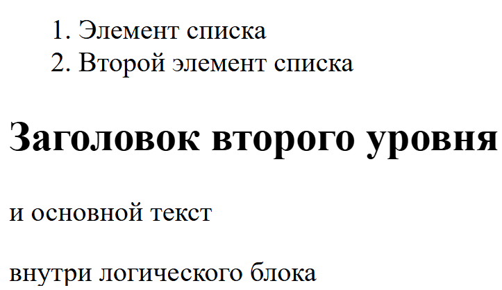

# Основы HTML
**HTML** (HyperText Markup Language) — стандартный язык разметки документов во
Всемирной паутине. Большинство веб-страниц созданы при помощи языка
HTML. Язык HTML интерпретируется браузером и отображается в виде
документа, в удобной для человека форме.

HTML создавался как язык для обмена научной и
технической документацией, пригодный для
использования людьми, не являющимися
специалистами в области вёрстки. Для этого он
представляет небольшой (сравнительно) набор
структурных и семантических элементов — тегов.

HTML не является языком программирования, но веб-страницы могут
содержать встроенные или загружаемые программы на скриптовых языках (в
первую очередь Javascript) и программы-апплеты на языке Java.

HTML-документ состоит из текста, который
представляет собой информационное содержимое
и специальных средств языка HTML — тегов
разметки, которые определяют структуру и
внешний вид документа при его отображении
браузером.

- Чтобы **создать документ HTML**, 
необходимо указать ему расширение `.html`

```
название.html
```

- Описание документа начинается с
указания его типа (секция DOCTYPE).

- Текст документа заключается в тег `<html>`. 
и состоит из
заголовка и тела, которые выделяются
соответственно тегами `<head>` и `<body>`.



- В заголовке `<head>` указывают
название HTML-документа и другие
параметры, которые браузер будет
использовать при отображении
документа.

- Тело документа `<body>` — это та
часть, в которую помещается
собственно содержимое HTML документа. Тело включает
предназначенный для отображения
текст и управляющую разметку
документа (теги), которые
используются браузером.

```html
<html>
    <head>
        <title>Моя первая страница</title>
        <meta charset="UTF-8">
    </head>
    <body>
        <h1>Заголовок моей первой страницы</h1>
        <div>
            <p>
                Мне очень нравится мой первый сайт, ведь я его создаю
                без помощи сторонних программ.
                <br>Мои эмоции радости
                можете посмотреть на картинке ниже:
            </p>
            <br>
            
        </div>
        <div>
            <p style="color: green">Этот текст зеленый</p>
            <p><b>А этот текст выделен жирным</b></p>
            <p>
                Как же мне нравится этот html! <br><br>
                Теперь мне осталось изучить теги html, и я смогу уже создавать
                страницы такими, какими я хочу.
            </p>
            <hr>
        </div>
    </body>
</html>
```

<hr>
Мета-тег HTML — это элемент разметки html, описывающий свойства
документа как такового (метаданные). Назначение мета-тега определяется
набором его атрибутов, которые задаются в теге `<meta>`.

Мета-теги размещают в блоке `<head>`...`</head>` веб-страницы. Они не
являются обязательными элементами, но могут быть весьма полезны.

```html
<head>
    <meta name="author" content="строка"> — автор веб-документа
    <meta name="date" content="дата"> — дата последнего изменения веб-страницы
    <meta name="copyright" content="строка"> — авторские права
    <meta name="keywords" content="строка"> — список ключевых слов
    <meta name="description" content="строка"> — краткое описание (реферат)
    <meta http-equiv="content-type" content="text/html; charset=UTF-8"> — тип и кодировка
    <meta http-equiv="refresh" content="число; URL=адрес"> — перенаправление
</head>
```

**Тег** (html-тег, тег разметки) —
управляющая символьная
последовательность, которая
задает способ отображения
гипертекстовой информации.

**HTML-тег** состоит из имени, за которым может
следовать необязательный список атрибутов.
Весь тег (вместе с атрибутами) заключается в
угловые скобки **<>**

Как правило, теги являются парными
и состоят из начального и конечного
тегов, между которыми и помещается
информация. Имя конечного тега
совпадает с именем начального, но
перед именем конечного тега
ставится косая черта **/
(`<html>`...`</html>`)**. Конечные теги
никогда не содержат атрибутов.
Некоторые теги не имеют конечного
элемента, например тег .
**Регистр символов для тегов не имеет
значения.**

```
<имя_тега [атрибуты]>
```
<hr>

# Основные тэги

```html
<html>...</html> — контейнер гипертекста
<head>...</head> — контейнер заголовка документа
<title>...</title> — название документа (то, что отображается в заголовке окна браузера)
<body>...</body> — контейнер тела документа
<div>...</div> — контейнер общего назначения (структурный блок)
<hN>...</hN> — заголовок N-ного уровня (N = 1...6)
<p>...</p> — основной текст
<a>...</a> — гиперссылка
<ol>...</ol> — нумерованный список
<ul>...</ul> — маркированный список
<li>...</li> — элемент списка
<table>...</table> — контейнер таблицы
<tr>...</tr> — строка таблицы
<td>...</td> — ячейка таблицы
...</img> — изображение
<form>...</form> — форма
<i>...</i> — отображение текста курсивом
<b>...</b> — отображение текста полужирным шрифтом
<em>...</em> — выделение (курсивом)
<strong>...</strong> — усиление (полужирным шрифтом)
<br> — принудительный разрыв строки
```

Теги могут быть вложены, при этом
форматирование внутреннего тега имеет
преимущество перед внешним. При
использовании вложенных тегов их нужно
закрывать, начиная с самого последнего и
двигаясь к первому

```html
<!-- Список как пример использования вложенных тегов -->
<ol>
    <li>Элемент списка</li>
    <li>Второй элемент списка</li>
</ol>
<div>
    <h2>Заголовок второго уровня</h2>
    <p>и основной текст</p>
    внутри логического блока
</div> 
```


<hr>

# Атрибуты

**Атрибуты** — это пары вида «свойство =
значение», уточняющие представление
соответствующего тега

```
<тег атрибут="значение">...</тег>
```

**Атрибуты** указывают в начальном теге, несколько атрибутов разделяют одним
или несколькими пробелами, табуляцией или символами конца строки.
Значение **атрибута**, если таковое имеется, следует за знаком равенства, стоящим
после имени **атрибута**. Порядок записи атрибутов в теге не важен. Если значение
атрибута — одно слово или число, то его можно просто указать после знака
равенства, не выделяя дополнительно. Все остальные значения **необходимо
заключать в кавычки**, особенно если они содержат несколько разделенных
пробелами слов.

<hr>

Атрибуты могут быть **обязательными и не обязательными**. Необязательные
атрибуты могут быть опущены, тогда для тега применяется значение этого
атрибута по умолчанию. Если не указан обязательный атрибут, то содержимое
тега скорее всего будет отображено неправильно.

- **style** = `"описание_стилей"` — локальные стили
- **src** = `"адрес"` — адрес (URI) источника данных (например картинки или скрипта)
- **align** = `"left|center|right|justify"` — выравнивание, по умолчанию left (по левому краю)
- **width** = `"число"` — ширина элемента (в пикселях, пиках, поинтах и др.)
- **height** = `"число"` — высота элемента (в пикселях, пиках, поинтах и др.)
- **href** = `"адрес"` — гиперссылка, адрес (URI), на который будет выполнен переход
- **name** = `"имя"` — имя элемента
- **id** = `"идентификатор"` — уникальный (в пределах веб-страницы) идентификатор элемента
- **size** = `"число"` — размер элемента
- **class** = `"имя_класса"` — имя класса во встроенной или связанной таблице стилей
- **title** = `"строка"` — название элемента
- **alt** = `"строка"` — альтернативный текст

**Гиперссылка** - это особым образом помеченный фрагмент веб-страницы (текст,
изображение и др.), который связан с другим документом. Для указания
гиперссылок используется тег `<a>`. Гиперссылки позволяют перемещаться между
связанными веб-страницами.

```html
<a href="http://example.com/">Пример</a>
<a href="ftp://example.com/archive.tar.gz">Скачать файл</a>
<a href="mailto://user@mail.example.com" title=“Письмо">user@mail.com</a>
```

Переход по ссылкам можно выполнять
как на целые документы, так и на
специальным образом помеченные
(именованные) фрагменты текста
```html
<h2 id="section1">Раздел 1</h2>
<p>Это текст первого раздела.</p>

<!-- Ссылка на якорь -->
<a href="#section1">Перейти к Разделу 1</a>
```

<hr>

**Абсолютные ссылки** - указывают, как
правило, на внешний ресурс. Для
них нужно указывать полный путь
```html
<a href="http://example.com/page.html">Абсолютная ссылка</a>
<a href="http://example.com/images/figure1.gif">Ссылка на картинку </a>
```

**Относительные** ссылки используют
для перехода на внутренние
страницы сайта. Для них нужно
указывать путь относительно
ссылающейся страницы

```html
<a href="/index.html">Ссылка на страницу в корневом каталоге</a>
<a href="page.html#seg1">Ссылка на фрагмент страницы в текущем каталоге</a>
<a href="images/figure1.gif">Ссылка на страницу в подкаталоге текущего каталога</a>
<a href="/docs/manual.html">Ссылка на страницу в подкаталоге корневого каталога</a>
<a href="../files/index.html">Ссылка на страницу в вышележащем каталоге </a>
```