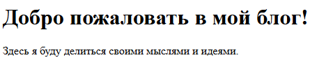
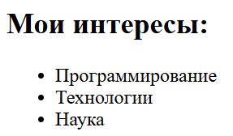
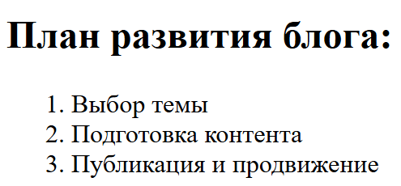
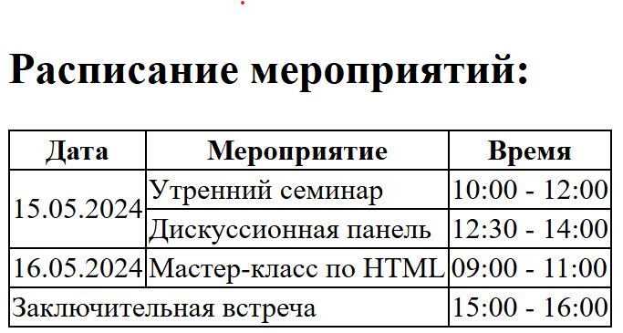

# HTML пример
Рассмотрим создание простой веб-страницы блога.

**Шаг 1: Стартовая структура страницы**

Создадим файл с расширением .html,
```
index.html
```
`index` - традиционное название файла, 
который используется как главная страница

Каждая HTML-страница начинается с базовой структуры: 
`<!DOCTYPE html>`, `<html>`, `<head>`, и `<body>`.

```html
<!DOCTYPE html>
<html lang="ru">
    <head>
        <meta charset="UTF-8">
        <meta name="viewport" content="width=device-width, initial-scale=1.0">
        <title>Мой блог</title>
        <style>
            table {
                border-collapse: collapse; /* Объединение границ ячеек */
            }
            th, td {
                border: 1px solid black; /* Граница ячеек */
            }
        </style>
    </head>
    
    <body>
    </body
</html>
```

- `<!DOCTYPE html>` — Указывает, что это документ HTML5.
- `<html lang="ru">` — Устанавливает язык страницы как русский.
- `<meta charset="UTF-8">` — Устанавливает кодировку страницы, чтобы поддерживались русские символы.
- `<title>` — Устанавливает название вкладки браузера.
- `<body>` — Содержит основной контент страницы.
- `<style>` - Внутри тега `<style>` находятся стили CSS, 
о них будет сказано в другом занятии. В данном случае
они нужны для создания границ у таблицы.

<hr>

**Шаг 2: Заголовок и приветствие**
```html
<h1>Добро пожаловать в мой блог!</h1>
<p>Здесь я буду делиться своими мыслями и идеями.</p>
```



- `<h1>` — Основной заголовок страницы.
- `<p>` — Параграф текста, объясняющий содержание блога.

<hr>

**Шаг 3: Ненумерованный список**

Теперь добавим ненумерованный список, 
например, с темами, которые 
можно обсуждать в блоге.

```html
<h2>Мои интересы:</h2>
<ul>
    <li>Программирование</li>
    <li>Технологии</li>
    <li>Наука</li>
</ul>
```



- `<ul>` — Ненумерованный список.
- `<li>` — Каждый элемент списка.
- Это нужно для перечисления элементов без нумерации.

<hr>

**Шаг 4: Нумерованный список**

Теперь добавим нумерованный список 
с шагами, в которых опишем 
как будем развивать свой блог.

```html
<h2>План развития блога:</h2>
<ol>
    <li>Выбор темы</li>
    <li>Подготовка контента</li>
    <li>Публикация и продвижение</li>
</ol>
```



- `<ol>` — Нумерованный список.
- `<li>` — Элементы списка, автоматически пронумерованные.

<hr>

**Шаг 5: Таблица**
В конце создадим таблицу,
со следующим содержанием.

```html
<h2>Расписание мероприятий:</h2>
<table>
    <tr>
        <th>Дата</th>
        <th>Мероприятие</th>
        <th>Время</th>
    </tr>
    <tr>
        <td rowspan="2">15.05.2024</td>
        <td>Утренний семинар</td>
        <td>10:00 - 12:00</td>
    </tr>
    <tr>
        <td>Дискуссионная панель</td>
        <td>12:30 - 14:00</td>
    </tr>
    <tr>
        <td>16.05.2024</td>
        <td>Мастер-класс по HTML</td>
        <td>09:00 - 11:00</td>
    </tr>
    <tr>
        <td colspan="2">Заключительная встреча</td>
        <td>15:00 - 16:00</td>
    </tr>
</table>
```



- `<table>` — Создаём таблицу с рамкой.
- `<th>` — Заголовки таблицы.
- `<tr>` — Строка таблицы.
- `<td>` — Ячейки таблицы.
- `rowspan="2"` — Объединяет между собой 2 ячейки по вертикале.
- `colspan="2"` — Объединяет между собой 2 ячейки по горизонтали.

<hr>

**Полный код**

```html
<!DOCTYPE html>
<html lang="ru">
    <head>
        <meta charset="UTF-8">
        <meta name="viewport" content="width=device-width, initial-scale=1.0">
        <title>Мой блог</title>
        <style>
            table {
                border-collapse: collapse; /* Объединение границ ячеек */
            }
            th, td {
                border: 1px solid black; /* Граница ячеек */
            }
        </style>
    </head>
    
    <body>
        <h1>Добро пожаловать в мой блог!</h1>
        <p>Здесь я буду делиться своими мыслями и идеями.</p>
    
        <h2>Мои интересы:</h2>
        <ul>
            <li>Программирование</li>
            <li>Технологии</li>
            <li>Наука</li>
        </ul>
    
        <h2>План развития блога:</h2>
        <ol>
            <li>Выбор темы</li>
            <li>Подготовка контента</li>
            <li>Публикация и продвижение</li>
        </ol>
    
        <h2>Расписание мероприятий:</h2>
        <table>
            <tr>
                <th>Дата</th>
                <th>Мероприятие</th>
                <th>Время</th>
            </tr>
            <tr>
                <td rowspan="2">15.05.2024</td>
                <td>Утренний семинар</td>
                <td>10:00 - 12:00</td>
            </tr>
            <tr>
                <td>Дискуссионная панель</td>
                <td>12:30 - 14:00</td>
            </tr>
            <tr>
                <td>16.05.2024</td>
                <td>Мастер-класс по HTML</td>
                <td>09:00 - 11:00</td>
            </tr>
            <tr>
                <td colspan="2">Заключительная встреча</td>
                <td>15:00 - 16:00</td>
            </tr>
        </table>
    </body
</html>
```