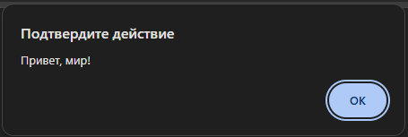
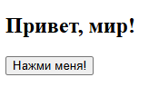
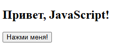

# JavaScript: Волшебный Язык для Веб-страниц

Привет, ребята! Сегодня мы узнаем, что такое **JavaScript** — язык программирования, который делает веб-страницы интерактивными и «живыми». Давайте рассмотрим это пошагово и с примерами!

---

## 1. Что такое JavaScript?

**JavaScript** — это язык программирования, который выполняется прямо в браузере. Он позволяет:
- Реагировать на нажатия кнопок
- Изменять содержимое страницы в реальном времени
- Создавать анимации и визуальные эффекты
- Проверять данные в формах перед отправкой

Это как волшебная палочка, превращающая обычную страницу в интерактивное приключение!

---

## 2. Простой пример: Окно с приветствием

Представьте, что вы заходите на сайт, и сразу появляется всплывающее окно с приветствием. Вот код, который это делает:

```html
<!DOCTYPE html>
<html>
  <head>
    <meta charset="UTF-8">
    <title>Пример JavaScript</title>
  </head>
  <body>
    <script>
      alert("Привет, мир!");
    </script>
  </body>
</html>
```

## 3. Интерактивный пример: Изменение текста на странице
Давайте создадим страницу с кнопкой, при нажатии на которую текст изменится. Вот пример такого кода:
```html
<!DOCTYPE html>
<html>
  <head>
    <meta charset="UTF-8">
    <title>Интерактивный пример с JavaScript</title>
  </head>
  <body>
    <h2 id="greeting">Привет, мир!</h2>
    <button onclick="changeGreeting()">Нажми меня!</button>

    <script>
      function changeGreeting() {
        document.getElementById("greeting").innerHTML = "Привет, JavaScript!";
      }
    </script>
  </body>
</html>
```
Было:



Стало:



Объяснение:
- Страница изначально показывает заголовок «Привет, мир!».
- При нажатии на кнопку вызывается функция changeGreeting(), 
которая ищет элемент с идентификатором greeting и меняет его содержимое на «Привет, JavaScript!».

## 4. Почему JavaScript важен?

JavaScript — один из основных инструментов для создания современных сайтов. Благодаря ему:
 - Страницы становятся динамичными и реагируют на действия пользователя.
 - Можно обновлять содержимое без перезагрузки страницы.
 - Реализуются сложные веб-приложения, игры и интерактивные сервисы.

